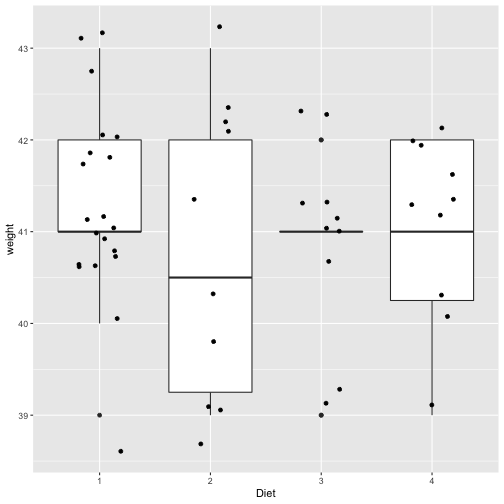
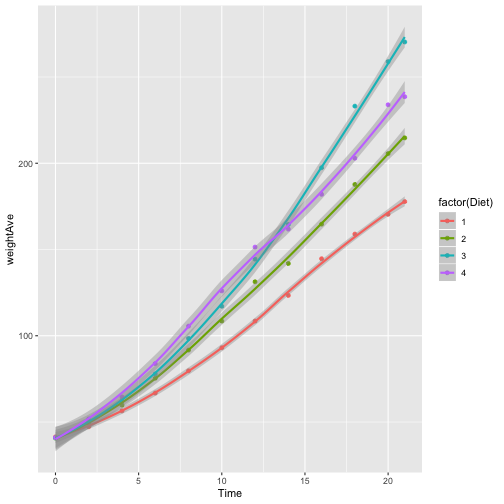

Chickgrowth
========================================================
author: Rena Wang
date: 24 Dec 2019
autosize: true

Background
========================================================

We are using Checkweight data frame in R to investigate the effect of diet on early Growth of Chicks.
The dataframe contains experimental data with  50 chicks seperate into 4 diet groups, and their weights were recorded upon their growth.

Chick growth Analysis
========================================================

Dataset: CheckWeight

- Boxplot for the weight distribution of newborn chicks used for different diet group
- Lineplot for the effect of diet on the growth of chicks.

Boxplot for the weight distribution of newborn chicks
========================================================

Line Plot for Average Chick Growth at Different Diet
========================================================

Conslusion
=======================================================
We concluded that Chicks with Diet 4 grow the fastest.
